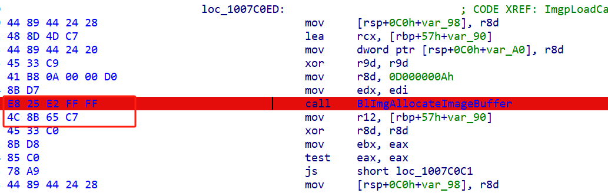

### UGuardMap编译

UGuardMap基于EFI-Guard + umap实现从引导阶段映射自定义驱动，再由驱动实现其他功能，UGuardMap则通过注入**winlogon**进程加载指定位置模块进而实现三环功能。


### 项目目录

**VisualUefi：**其中包含修改过的包EfiGuardPkg

**WebBK：**待映射的驱动

**test**：用于驱动注入的模块，简单的在桌面创建一个txt空文本


### 如何编译

**驱动文件**（EfiGuardDxe）：可以直接使用**VisualEFI**编译

**引导文件**（Loader）：

截至目前（2024.08.10），EFIGuard最新版本为V1.4

由于当前版本使用了协议**gEfiLegacyBiosProtocolGuid**，所以使用**VisualEfi**无法编译，还是需要使用edk2来编译。

- 克隆**edk2-stable202311** 或者之前的Tag，否则[edk2/OvmfPkg/OvmfPkg.dec at edk2-stable202311 · tianocore/edk2 · GitHub](https://github.com/tianocore/edk2/blob/edk2-stable202311/OvmfPkg/OvmfPkg.dec) 不包含协议gEfiLegacyBiosProtocolGuid，随后被弃用了。

- 克隆**edk2-BaseTools-win32**到edk2的同级目录
  - git clone --recursive https://github.com/tianocore/edk2-BaseTools-win32

- 启动**CMD**，设置环境变量，路径修改为edk\BaseTools路径
  - set WORKSPACE=D:\UEFI\workspace
  - set EDK_TOOLS_PATH=D:\UEFI\workspace\edk2\BaseTools
  - set EDK_TOOLS_BIN=D:\UEFI\workspace\edk2-BaseTools-win32
  - set PACKAGES_PATH=D:\UEFI\workspace\edk2
  
- 执行edk2\edksetup.bat (window平台)

- 将项目中的EfiGuardPkg包复制一份到edk2目录下

- **build -a X64 -t VS2019 -p EfiGuardPkg/EfiGuardPkg.dsc -b RELEASE** 构建64位Realese版本efi.

**WebBk**：webbk正常编译即可，编译完成之后二进制硬编码在EfiGuardDxe的**mapper.h**中

**test**：正常编译


### 你需要修改的

**EfiGuardDxe**：修改函数**UMap_HookBlImgAllocateImageBuffer**中BlImgAllocateImageBuffer特征码

当前在windows 22h2的指纹如下（在bootmgfw.efi中查找）

```
    VOID* funcCall =
        UMap_FindPattern(ImageBase, ImageSize,
            "\xE8\x00\x00\x00\x00\x4c\x8b\x65\xc7", "x????xxxx");
```



修改mapper.h，将驱动硬编码到其中

**WebBk**：修改函数**ThreadFunction**中模块的路径或者被注入进程


### 如何使用

准备一块fat32格式的U盘，修改编译好的Loader.efi为bootx64.efi同EfiGuardDxe.efi一起放入**EFI\Boot**目录下

禁用安全启动

启动计算机并从U盘进行引导


### 引用

https://github.com/Mattiwatti/EfiGuard

https://github.com/btbd/umap

https://github.com/DarthTon/Blackbone
